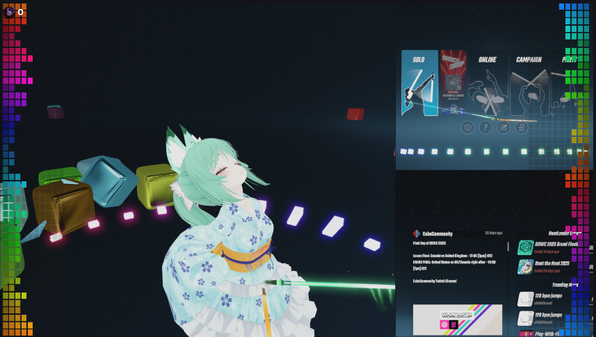
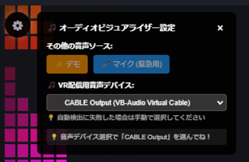

# 🎯 OBS オーバーレイ用オーディオスペクトラム




### 必要なもの
- VB-CABLE
- Audio Monitor プラグイン

---

## 🔧 設定手順

### ステップ1: VB-CABLEとAudio Monitor プラグインをインストール

[VB-CABLE](https://vb-audio.com/Cable/)  
[Audio Monitor プラグイン](https://obsproject.com/forum/resources/audio-monitor.1186/)

### ステップ2: OBSでオーディオモニターを設定
1. **音声ソース**（アプリケーション音声キャプチャ等）を右クリック
2. **フィルタ** → **+** → **Audio Monitor**（オーディオモニター）を追加
3. **デバイス** → **CABLE Input** を選択

### ステップ3: ビジュアライザーで音声を選択
1. **ブラウザソース**を追加して、ビジュアライザーのindex.htmlファイルを設定する（解像度は環境に合わせて変更してください）
2. **追加したブラウザソース**を選択して、プレビュー画面下にある対話を押す
3. **音声デバイスの選択**:
   - 🎵 **自動検出**: CABLE Outputが見つかった場合は自動で接続を試行
   - 🔧 **手動選択**: 自動接続が失敗した場合は**音声デバイス選択**から **🎵 CABLE Output** を選択
   - 💡 **操作方法**: マウスクリックでプルダウンが出ない場合はキーボードのカーソルキーで選択
   
   
4. **完了！** 🎉

> **💡 ヒント**: ビジュアライザーは起動時にCABLE Outputを自動検出して接続を試行します。左上の状態表示で接続状況を確認できます。

---

## 🎨 ビジュアライザーのカスタマイズ

### 基本設定の変更
`script.js`の冒頭にある`config`オブジェクトを編集することで、見た目や動作をカスタマイズできます。

```javascript
const config = {
    // === 基本設定 ===
    fftSize: 1024,           // 音声解析の精度 (32-32768, 2の累乗)
    smoothing: 0.3,          // スムージング強度 (0.0-1.0)
    
    // === ドット設定 ===
    dotSize: 16,             // 各ドットのサイズ (px)
    dotGap: 4,               // ドット間の隙間 (px)
    dotsPerBar: 10,          // 1つの周波数バーあたりのドット数
    barHeight: 20,           // 周波数バーの高さ (px)
    barGap: 4,               // 周波数バー間の隙間 (px)
    
    // === ステレオ設定 ===
    stereoMode: true,        // ステレオ表示 (true/false)
    
    // === 色設定 ===
    rainbowBaseHue: 0,       // レインボーの開始色相 (0-360)
    rainbowRange: 360,       // レインボーの色相範囲 (0-360)
    minSaturation: 70,       // 最小彩度 (0-100)
    maxSaturation: 100,      // 最大彩度 (0-100)
    minLightness: 15,        // 最小明度 (0-100)
    maxLightness: 85,        // 最大明度 (0-100)
    
    // === ステレオ色分け ===
    leftChannelHueOffset: 0,    // 左チャンネル色相オフセット
    rightChannelHueOffset: 180, // 右チャンネル色相オフセット
    
    // === 透明度設定 ===
    unlitDotOpacity: 0.5,    // 非点灯ドットの透明度 (0.0-1.0)
};
```

### よく使うカスタマイズ例

#### 🎨 色をカスタマイズ
```javascript
// 青系グラデーション
leftChannelHueOffset: 200,   // 青
rightChannelHueOffset: 280,  // 紫

// 暖色系
leftChannelHueOffset: 0,     // 赤
rightChannelHueOffset: 30,   // オレンジ

// 単色（レインボー無効）
rainbowRange: 0,             // レインボー無効
rainbowBaseHue: 120,         // 緑で固定
```

#### 📏 サイズを調整
```javascript
// 大きなドット
dotSize: 24,
barHeight: 30,

// 小さなドット（高解像度用）
dotSize: 12,
barHeight: 15,

// ドット数を増やす
dotsPerBar: 15,
```

#### ⚡ パフォーマンス調整
```javascript
// 高精度（重い）
fftSize: 2048,

// 低精度（軽い）
fftSize: 512,

// 滑らかな動き
smoothing: 0.8,

// 激しい動き
smoothing: 0.1,
```

#### 🎵 音声感度調整
`script.js`内の`thresholds`配列を編集することで、音声レベルに対するドットの反応を調整できます：

```javascript
// 低音域（画面下部）- より敏感に
thresholds = [10, 25, 45, 70, 100, 135, 175, 220, 270, 325];

// 高音域（画面上部）- より鈍感に
thresholds = [20, 45, 80, 125, 180, 245, 320, 405, 500, 610];
```

### 🎮 UI設定
設定パネルは左上の⚙️ボタンで開閉できます：
- **起動時**: 5秒間自動表示後に閉じる
- **手動操作**: ⚙️ボタンまたは×ボタンで開閉
- **配信中**: 最小限の表示で邪魔にならない

### 💡 カスタマイズのコツ
1. **設定変更後はページをリロード**して反映
2. **デモモード**で見た目を確認してから実際の音声に切り替え
3. **配信解像度に合わせてサイズ調整**（1080p, 1440p等）
4. **VRゲームの音楽特性に合わせて感度調整**

